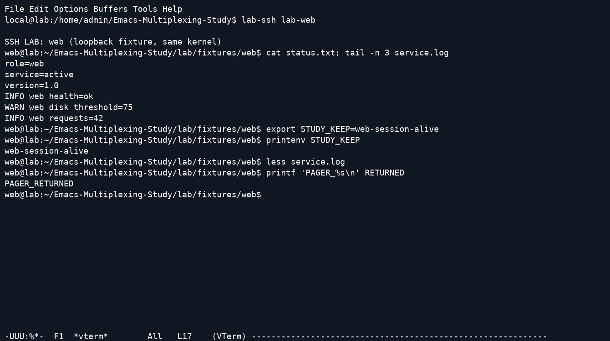

# Terminal emulator e multiplexer per Emacs

Studio del 26 settembre 2026. Il risultato è un catalogo ampio con snapshot dei sorgenti, analisi architetturali, prove osservabili e un laboratorio riproducibile. **Non è una dimostrazione di completezza su tutti i progetti mai creati, né una certificazione end-to-end di tutte le voci del catalogo.** Progetti cancellati, non indicizzati, privati o citati soltanto in configurazioni personali possono mancare. Le voci senza video lo dichiarano esplicitamente.

Aprire [il catalogo con i player](../index.html). I conteggi aggiornati sono generati dai risultati in [summary.json](summary.json); la tabella completa e leggibile anche su GitHub è [CATALOGUE.md](CATALOGUE.md). Non sommare dipendenze, fork e alias per ottenere un presunto numero di emulatori indipendenti.

## Risultati che servono a scegliere un workflow

Per lavorare alternando più SSH, molti progetti non richiedono un layout con pannelli: un terminale per buffer e il normale `C-x b` bastano. I gestori aggiungono nomi, scope per progetto, cycling, popup o layout. Le prove riuscite verificano che la shell del server web conservi una variabile mentre si lavora sul server db e che la si ritrovi tornando indietro.

| Esigenza | Famiglie/progetti da confrontare | Cosa dimostra questo studio |
|---|---|---|
| Terminale interattivo nel buffer | term/ansi-term, Eat, vterm, Ghostel, Ebb, Alacritty, Kuro, Cooked, MisTTY, Coterm | Due SSH, output riconoscibile, ritorno alla stessa shell; pager nei profili appropriati |
| Creare e ritrovare buffer | multi-term, multi-vterm, multi-buf, multi-buffer, term-manager, term-control, vtermux | Scenario registrato e modalità effettiva nelle snapshot |
| Layout e finestre | ghostel-mux, tab-bar, ElScreen, Eyebrowse | Cambio contesto mantenendo i processi; nessuna persistenza dopo chiusura dedotta dal layout |
| Riattaccare processi dopo l'uscita di Emacs | tmux annidato in vterm, tmux-control, term-sessions/zmx | Chiusura reale di Emacs, nuovo processo Emacs e recupero della variabile della shell originale |
| Richiamare velocemente una shell | shell-pop, vterm-toggle, eshell-toggle, popterm, toggle-term, term-toggle | Apertura/selezione con le differenze strutturali dichiarate nei copioni |
| Amministrazione con output lineare | shell, Eshell, friendly-shell, better-shell, multi-shell | Baseline utili; non presentati come emulatori VT completi |
| Controllare terminali esterni | emamux, tmux.el, tmuxmacs, turnip, screensend, zellij.el | emamux dimostrato come controller; tmux-view come viewer. Gli altri hanno analisi/probe senza attribuire un renderer in-buffer inesistente |

La distinzione importante è **chi possiede il processo**. Nei terminali ordinari il processo dipende da Emacs; un gestore di finestre può soltanto conservarne la visibilità mentre Emacs rimane vivo. Nei test di persistenza il processo è posseduto da un server tmux o zmx separato. Il riavvio di Emacs è realmente avvenuto, non è una semplice chiusura del buffer.

## Metodo di studio del codice

Le revisioni sono elencate in [source-lock.json](../research/source-lock.json). Il bundle completo contiene il codice acquisito, non solo link a HEAD mobili. Per ogni progetto la scheda riporta architettura, utilizzo, limiti, stato del caricamento e risultato delle prove disponibili. Gli [indici](code-index/term.html) danno punti di ingresso, `require`, opzioni e keymap con numeri di riga; sono generati automaticamente e **non sostituiscono una revisione manuale di ogni riga**.

La lettura architetturale si è concentrata su creazione del processo/PTY, parser, aggiornamento del buffer, routing dei tasti, registro delle sessioni e durata dei processi. Gli estratti di supporto sono in `research/review-*.txt`. Non è un audit di sicurezza, né una prova formale o una revisione completa di tutti i test upstream.

Esempi concreti nel codice incluso:

- `sources/vterm/vterm-module.c`: `vterm_input_write` alimenta libvterm; le celle sono lette attraverso `vterm_screen_get_cell`. Il modulo registra l'interfaccia Lisp in `emacs_module_init`.
- `sources/alacritty/src/lib.rs`: il codice dello snapshot affida il PTY a Emacs e riceve output tramite filtro; il modulo Rust gestisce `alacritty_terminal`. Non va descritto come finestra dell'applicazione Alacritty inglobata.
- `sources/cooked/src/lib.rs` e moduli `pty`, `session`, `emu`: il core registra funzioni Lisp e mantiene stato del processo e degli aggiornamenti; il comportamento dei tasti cambia quando il processo richiede input raw.
- `sources/kuro/rust-core/src/parser.rs`, `ffi/bridge/render.rs` e `emacs-lisp/rendering/`: parsing e trasporto/rendering sono livelli distinti.
- `sources/ghostel/src/GhostelTerm.zig`, `Renderer.zig`, `PosixPtyProcess.zig` e Lisp: backend terminale, resa e processo sono separati. Il test usa il modulo della release corrispondente.
- `sources/libgterm/src/gterm.zig`: renderer che percorre le celle dello schermo Ghostty. È un progetto separato da Ghostel anche se usa la stessa famiglia di motore.
- `sources/mistty/mistty.el`: buffer di lavoro, buffer terminale, sincronizzazione e passaggio allo schermo intero spiegano perché editarne l'input non equivale a inviare ogni tasto direttamente al PTY.
- `sources/multi-buffer/multi-buffer.el`: rinomina e registro per major-mode, senza launcher/cycler proprio. Lo snapshot non fornisce la feature omonima; il profilo dimostrativo usa `load` esplicito.
- `sources/tmux-control/` e `sources/tmux-control-mode/`: entrambi usano il protocollo di controllo tmux ma hanno renderer e UI diversi. Il secondo fornisce `tmux-cc`, nome usato anche da un terzo progetto di wcy123: il probe controlla la provenienza della libreria.

## Scenario amministratore di sistema

Il laboratorio avvia due `sshd` non privilegiati su `127.0.0.1`, porte 22461 e 22462, con identità host fissata e chiavi effimere del test. Alias: `lab-web` e `lab-db`. Sono **due endpoint SSH reali sullo stesso host e kernel**, non due macchine indipendenti. La shell forzata presenta fixture deterministiche: `status.txt` e `service.log`. Non vengono usate credenziali dell'utente e non si modifica `~/.ssh`.

Il workflow comune è:

1. Avviare Emacs `-Q -nw` con il profilo del progetto. Vertico e Marginalia sono caricati e abilitati prima di ogni comando.
2. Aprire il terminale attraverso `M-x` e i prompt reali, senza chiamate Lisp nascoste per costruire la demo.
3. Digitare `lab-ssh lab-web`, quindi `cat status.txt; tail -n 3 service.log`.
4. Conservare `STUDY_KEEP=web-session-alive` nella shell remota.
5. Creare una seconda sessione con il comando/prefisso appropriato; collegarsi a `lab-db` e controllarne stato e log.
6. Tornare al primo terminale con il comando del pacchetto o `C-x b`; `printenv STUDY_KEEP` deve produrre la variabile precedente.
7. Dove il profilo è un emulatore completo, aprire `less service.log`, uscire con `q` e verificare un nuovo output della shell.
8. Nei copioni specifici tmux/zmx, uscire da Emacs, verificare la sessione esterna e riattaccarsi da un altro Emacs.

`passed` significa che le asserzioni di quello scenario sono riuscite. Non significa compatibilità universale con ncurses, Unicode complesso, mouse, immagini, clipboard, latenza di rete, TRAMP, resize arbitrari o perdita di connettività. Nessuna classifica di throughput è ricavata da queste registrazioni. I confronti prestazionali pubblicati da upstream/Reddit non sono stati riutilizzati come misure nostre.

Fotogramma ricostruito dagli eventi reali del cast con pyte e FFmpeg; mostra il ritorno alla shell web e l’uscita dal pager. La registrazione completa è nel catalogo.

## Tasti: cosa è davvero predefinito

Non sono state create rimappature globali per uniformare artificialmente i progetti. Quando il pacchetto non assegna un binding globale, si usa `M-x nome-comando RET`: questo è un uso umano dei comandi pubblici, non un'interfaccia appositamente costruita. Gli hook e le opzioni necessarie sono visibili in `scripts/scenarios.py` e `config/init.el`.

| Contesto | Sequenza osservata o usata |
|---|---|
| Nuova istanza vterm/Eat/Ghostel/MisTTY | `C-u M-x … RET` |
| Più shell comint | `C-u M-x shell RET`, poi nome del nuovo buffer |
| term/ansi-term | `C-c C-j` verso editing Emacs, `C-c C-k` verso input caratteri |
| Cooked con input remoto raw | `C-c M-x` per il comando Emacs |
| ghostel-mux | `C-b c` e `C-b p` |
| tmux annidato | `C-b c` e `C-b p`, interpretati da tmux |
| tmux-control | `M-x tmux-control-new-window`, `C-c C-p` |
| Tab-bar | `C-x t 2`, `C-x t O` |
| ElScreen | `C-z c`, `C-z p`, dopo aver restituito i tasti a Emacs |
| Buffer generico | `C-x b`, nome, `RET` |

Ogni scheda dimostrata include una sequenza completa con timestamp e una traccia dei byte inviati. Non confondere i binding suggeriti nei README con quelli già attivi. Vertico e Marginalia rimangono abilitati anche se un progetto usa una UI separata Helm; tale UI non viene sostituita surrettiziamente.

## Esiti negativi e correzioni del laboratorio

Le versioni precedenti di risultati, tasti e cast sono in `results/attempts/`. Lo smoke test nel contenitore pulito è riuscito dopo aver corretto anche la directory del socket tmux, che deve essere la stessa prima e dopo il riavvio del client. Il primo tentativo negativo e quello corretto sono entrambi conservati. Le correzioni hanno riguardato il copione o la preparazione, senza correggere silenziosamente il codice upstream:

- terminfo di Eat/Ghostel/Ebb mancanti sul remoto impedivano un pager corretto: ora vengono compilate con `tic` e rese disponibili ai due endpoint.
- `term-run` mostra il buffer in un'altra finestra: occorre `C-x o` prima di digitare.
- il socket del server Emacs, sotto un percorso XDG molto lungo, superava il limite Unix: ora usa una directory privata più corta.
- dipendenze normalmente caricate da autoload, come vterm per alcuni wrapper, sono caricate esplicitamente nel profilo isolato.
- il copione iniziale confondeva `C-x t p` con il tab precedente; il default corretto usato nella prova è `C-x t O`.

Restano scenari negativi espliciti, fra cui riuso del buffer in vtplex, riferimento a `ghostel--all-buffers` assente nello snapshot di Ghostel per ghostel-switch, routing term+ non gestito correttamente dal copione generico e focus non recuperato nel caso tmux-control-mode. Le schede e i traceback circoscrivono ciò che è successo: un errore di copione non viene presentato come una conclusione generale sull'affidabilità del progetto.

## Copertura non completata

Non è stata prodotta una dimostrazione per ciascuna voce: i progetti GUI EAF, i motori Windows, diversi controller di multiplexer esterni e vari pacchetti storici hanno analisi/probe ma non una prova end-to-end. libgterm ha un tentativo di build documentato, non un modulo funzionante. Alcune voci irrisolte sono solo URL candidati falliti. Il catalogo espone `not-run` invece di attribuire risultati dei componenti sottostanti al wrapper.

Sono quindi consegnati strumenti estendibili, prove effettive e un inventario delle lacune, senza dichiarare soddisfatto il requisito letterale “ogni progetto mai creato, tutti eseguiti”. Per l'elenco puntuale filtrare `not-run` nel catalogo. La ricerca e le esclusioni sono descritte in [SEARCH.md](SEARCH.md); la procedura eseguibile è in [REPRODUCE.md](REPRODUCE.md).
